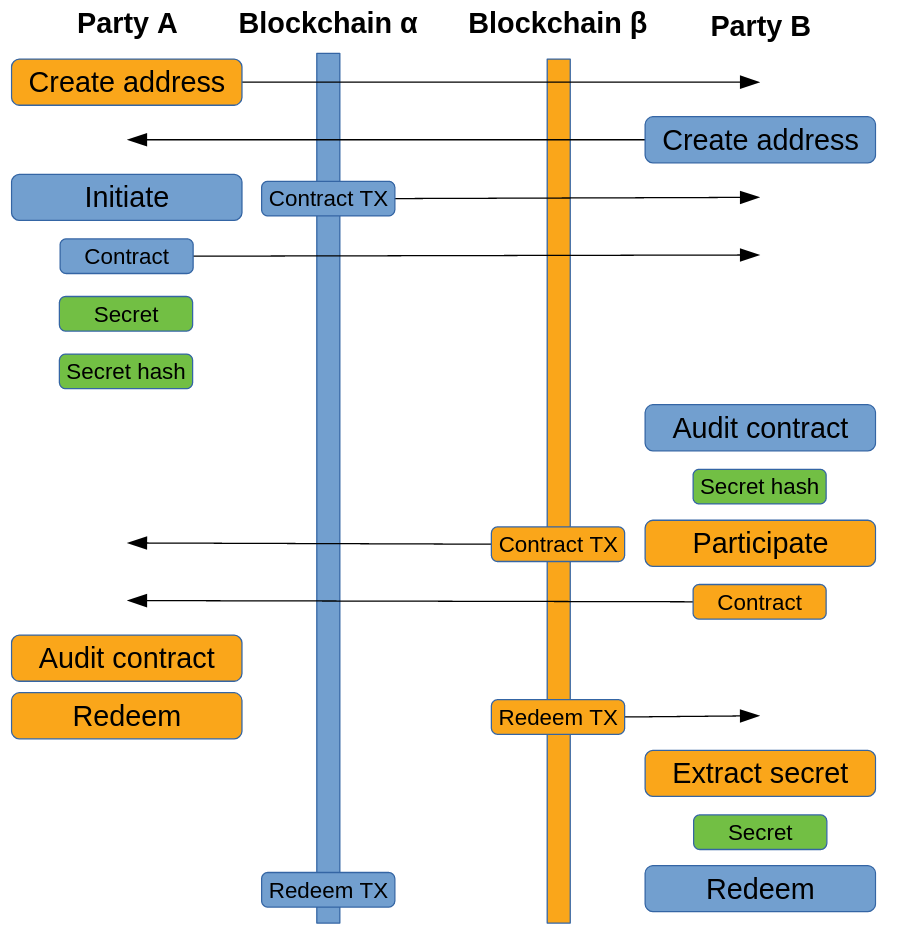

# Developers Contest: Atomic Swaps on Free TON

## Requirements
* The possibility of a safe return of funds to each of the parties if the other party does not comply with the terms of the trade
* Open sources of smart contracts published at GitHub/GitLab or another open repository
* Documentation
* Name and contact information of the contestant for communication (Telegram username, e-mail)

## Summary

**Author - Nail Khafizov**, independent software developer. 
- [t.me/nailkhaf](t.me/nailkhaf)    
- 854297992c@gmail.com

### Implementation and demonstration smart contracts of Atomic Swaps:
`Ton Crystal`, `Native Ether`, `Ethereum ERC20`, `Bitcoin`

### Motivation
**Develop an infrastructure** that allows users **to perform transactions between different blockchains** without escrow in an untrusted environment. It will make the exchange market around TON Crystal more secure for OTC transactions.

### Abstract 
**Atomic Swap** — a smart contract technology enables the exchange of one cryptocurrency for another without using centralized intermediaries (such as exchanges). 
I've learned two ways of swaps:
1. By using **H**ashed **T**ime**L**ock **C**ontract
2. By using **S**implified **P**ayment **V**erification.

**HTLC** — the most simple. It requires supporting common hash function (e.g. `sha256`) from blockchain and TimeLock contract functionality.    
**`+`** Сan be fully decentralised  
**`-`** Requires side communication between participants and locking money on specific time

**SPV** requires from one of two blockchains supporting runnig complex smart contracts (e.g. `Ethereum` or `Ton`) to verify transaction's Merke Proof of transfer.  
**`+`** Transfer can be fast and automatic  
**`-`** Requires solution to identify the source of the transaction: 
*mainnet / testnet / side blockchain by using oracles smart contracts / supporting **SPV** verification by validators.*

---

I chose **HTLC**, because:
- Time of contest is limited to 3 weeks
- High transmission speed can be achieved through automation Atomic Swap Wallet, which supports **SPV** verification different blockchains off-chain.
---

## Implementation

### Tech Stack
**FreeTon**: `TON-Solidity-Compiler`, `Solidity`, `JS` for testing  
**Ethereum**: `Truffle`, `Solidity`, `JS` for testing  
**Bitcoin**: `bitcoinjs-lib`, `JS`

### Repository structure
[`./ton`](https://github.com/nailkhaf/freeton-atomic-swap/tree/master/ton) - Atomic Swap Contracts for FreeTon blockchain  
[`./eth`](https://github.com/nailkhaf/freeton-atomic-swap/tree/master/eth) - Atomic Swap Contracts for Ethereum blockchain  
[`./btc`](https://github.com/nailkhaf/freeton-atomic-swap/tree/master/btc) - Atomic Swap Contracts for Bitcoin blockchain  
[`./app`](https://github.com/nailkhaf/freeton-atomic-swap/tree/master/app) - App for demostrating working of Smart Contracts at testnets. Not used in production, only for learning purpose

### WorkFlow

### Commands:
`initiate` *(participant address, amount, secret hash, lock time)*    
`participate` *(initiator address, amount, secret hash, lock time)*   
`redeem` *(secret)*  
`refund`  

### Steps:

1. **Part A** have to generate the secret limited by 32 bytes and store it securely. Next, **Part A** `initiate` and create contract with hash of secret and participant's address. In this contract the locktime should be doubled to avoid scam (e. g. `24h * 2 = 48h`). After that, **Part A** have to send transaction or smart contract address to **Part B**. 
2. **Part B** have to verify **Part A**'s contract: *participant's address, lockTime, amount, hash of code*. If everything is OK — **Part B** should `participate` and create contract with **Part A**'s secret hash, otherwise **Part B** can do nothing. **Part B** should be careful, lockTime should be less **Part A**'s lockTime at the moment of creating contract. After, **Part B** have to send transaction or smart contract address to **Part A**.
3. **Part A** have to verify **Part B**'s contract. If everything is OK — **Part A** can `redeem` from **Part B**'s contract and reveal secret, otherwise **Part A** can wait timeLock and refund his transfer. 
4. **Part B** should extract secret and `redeem` from **Part A**'s contract.

>The most part of steps can be automated by wallet, with the exception of exchange address and transactions

## [Demonstration](https://github.com/nailkhaf/freeton-atomic-swap/blob/master/DEMONSTRATION.md)

## References

https://www.investopedia.com/terms/a/atomic-swaps.asp  
https://github.com/decred/atomicswap  
https://medium.com/summa-technology/cross-chain-auction-technical-f16710bfe69f